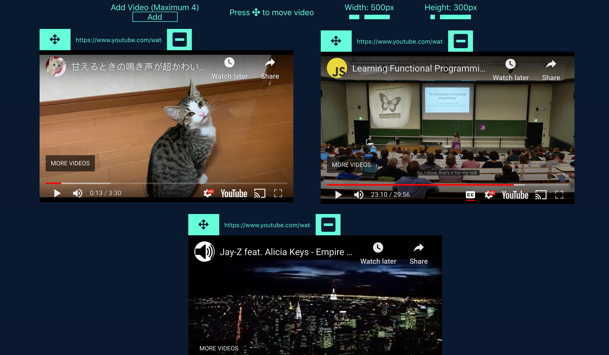

# Youtube Draggable

`Youtube Draggable` is a react app that allows you to play up to 4 Youtube videos synchronously on a single webpage. The videos are also draggable and resizable within the webpage.

## [Live Demo](https://youtube-draggable.herokuapp.com/)

### Tools used in this project:

|                               Tool                               | Description                                                                                           |
| :--------------------------------------------------------------: | ----------------------------------------------------------------------------------------------------- |
|       [React](http://facebook.github.io/react/index.html)        | A JavaScript library for building user interfaces                                                     |
|                  [SASS](https://sass-lang.com/)                  | Sass is the most mature, stable, and powerful professional grade CSS extension language in the world. |
| [react-draggable](https://www.npmjs.com/package/react-draggable) | A NPM package that provides a simple component for making elements draggable.                         |
